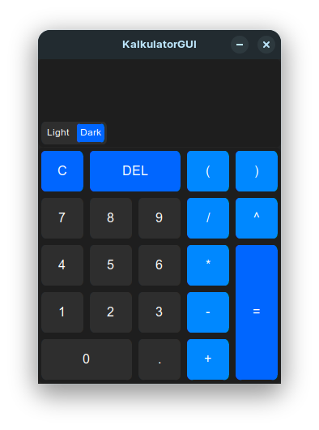
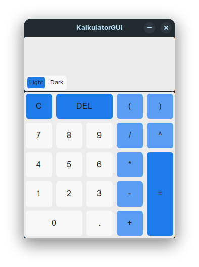

<p align="center">
  
</p>

<h1 align="center">KalkulatorGUI</h1>

<p align="center">
  A desktop calculator application built with Python and CustomTkinter.
</p>

<p align="center">
  <a href="https://github.com/NaN-code01/KalkulatorGUI/actions/workflows/tests.yaml">
    
  </a>
  <a href="https://www.python.org/">
    
  </a>
  <a href="https://github.com/NaN-code01/KalkulatorGUI/blob/main/LICENSE">
    
  </a>
  <a href="https://github.com/NaN-code01/KalkulatorGUI/releases">
    
  </a>
</p>

---

## 📖 Description

**KalkulatorGUI** is a desktop calculator application developed in Python using **CustomTkinter** for its graphical user interface.

The application provides a straightforward interface for entering and evaluating mathematical expressions while keeping the graphical interface, expression validation, calculation logic, and supporting utilities separated into dedicated modules.

KalkulatorGUI supports standard arithmetic operations, exponentiation, parentheses, negative values, implicit multiplication, expression validation, and keyboard input. Mathematical expressions are processed through tokenization and validation before being converted from infix notation to postfix notation using the **Shunting Yard algorithm** and subsequently evaluated.

The project is primarily developed and tested on Linux-based systems, with current testing focused on Ubuntu-based distributions.

## ✨ Features

* 🧮 **Basic arithmetic operations**

  * Addition (`+`)
  * Subtraction (`-`)
  * Multiplication (`*`)
  * Division (`/`)
* 🔢 **Exponentiation** using `^`
* 🧩 **Parentheses** for controlling expression precedence
* ➖ **Negative values and unary operators**
* ✖️ **Implicit multiplication**, such as `2(3+4)`
* ✅ **Expression validation** before evaluation
* ⌨️ **Keyboard integration** for entering expressions and calculator commands
* 🌓 **Light and dark themes**
* ⚠️ **Error display** for invalid expressions
* 📜 **Scrollable expression display** for longer expressions
* 🧠 **Shunting Yard algorithm** for infix-to-postfix conversion
* 🧪 **Automated testing** with pytest
* 🤖 **Continuous Integration** with GitHub Actions

## 🛠️ Built With

* 🐍 **[Python](https://www.python.org/)** — Application programming language
* 🎨 **[CustomTkinter](https://github.com/TomSchimansky/CustomTkinter)** — Graphical user interface
* 🧪 **[pytest](https://pytest.org/)** — Automated testing
* 📦 **[PyInstaller](https://pyinstaller.org/)** — Executable packaging
* 🤖 **GitHub Actions** — Continuous integration

## 🖼️ Screenshots

### 🌙 Dark Mode

<p align="center">
  
</p>

### ☀️ Light Mode

<p align="center">
  
</p>

## 🎬 Usage

The application can be operated using both the graphical buttons and the keyboard.

<p align="center">
  
</p>

## ⚙️ How It Works

KalkulatorGUI processes mathematical expressions through several stages:

```text
Expression Input
       │
       ▼
   Tokenization
       │
       ▼
    Validation
       │
       ▼
Infix → Postfix
       │
       │
       ▼
   Evaluation
       │
       ▼
     Result
```

The **Shunting Yard algorithm** is used to convert an infix mathematical expression into postfix notation while taking operator precedence and associativity into account.

This keeps the expression-processing logic separate from the graphical interface and allows the calculation components to be tested independently.

## 📥 Download

Executable releases are distributed through **GitHub Releases**.

> **Note:** AppImage releases are planned but are not currently available.

**[View Releases](https://github.com/NaN-code01/KalkulatorGUI/releases)**

Once an AppImage is available, it will be provided through the Releases page.

## 🚀 Running from Source

### 📋 Requirements

* 🐧 Linux-based operating system
* 🐍 Python **3.12 or newer**
* `pip`
* Tkinter

KalkulatorGUI has currently been tested on Ubuntu-based Linux distributions.

### 1️⃣ Clone the Repository

```bash
git clone https://github.com/NaN-code01/KalkulatorGUI.git
cd KalkulatorGUI
```

### 2️⃣ Create a Virtual Environment

Create a Python virtual environment:

```bash
python -m venv venv
```

Activate it:

```bash
source venv/bin/activate
```

### 3️⃣ Install Requirements

Install the project's Python dependencies:

```bash
python -m pip install -r requirements.txt
```

The current dependencies include:

* `customtkinter` — Graphical user interface
* `pytest` — Automated testing
* `pyinstaller` — Executable packaging

### 4️⃣ Run the Application

Start KalkulatorGUI with:

```bash
python main.py
```

## 🧪 Testing

KalkulatorGUI includes an automated test suite using **pytest**.

Tests are organized into separate files covering the calculator, utility functions, and expression validation.

Run the tests locally with:

```bash
python -m pytest -v
```

### 🤖 Continuous Integration

The project uses **GitHub Actions** to automatically run the test suite.

The workflow is triggered when changes are pushed to, or pull requests are opened against, the `main` branch.

The CI environment currently uses **Python 3.12** and executes the same pytest command used for local testing.

**[View GitHub Actions](https://github.com/NaN-code01/KalkulatorGUI/actions)**

## 📁 Project Structure

```text
KalkulatorGUI/
├── .github/
│   └── workflows/
│       └── tests.yaml
├── assets/
│   ├── icon.ico
│   ├── icon.png
│   ├── preview_dark_mode.png
│   ├── preview_demo.gif
│   ├── preview_light_mode.png
│   └── theme.json
├── modules/
│   ├── __init__.py
│   ├── calculator.py
│   ├── constants.py
│   ├── gui.py
│   ├── utils.py
│   └── validator.py
├── tests/
│   ├── test_calculator.py
│   ├── test_utils.py
│   └── test_validator.py
├── .gitignore
├── LICENSE
├── main.py
├── README.md
└── requirements.txt
```

### 📂 Directory Overview

| Path                 | Purpose                                                                      |
| -------------------- | ---------------------------------------------------------------------------- |
| `.github/workflows/` | GitHub Actions workflow configuration                                        |
| `assets/`            | Application icons, theme configuration, screenshots, and demonstration media |
| `modules/`           | Core application logic, GUI components, validation, and utilities            |
| `tests/`             | Automated test suite                                                         |
| `main.py`            | Application entry point                                                      |
| `requirements.txt`   | Python dependencies                                                          |
| `LICENSE`            | Project license                                                              |

## 📄 License

KalkulatorGUI is released under the **MIT License**.

See the [LICENSE](LICENSE) file for the full license text.

---

<p align="center">
  <sub>Built with Python and CustomTkinter.</sub>
</p>
